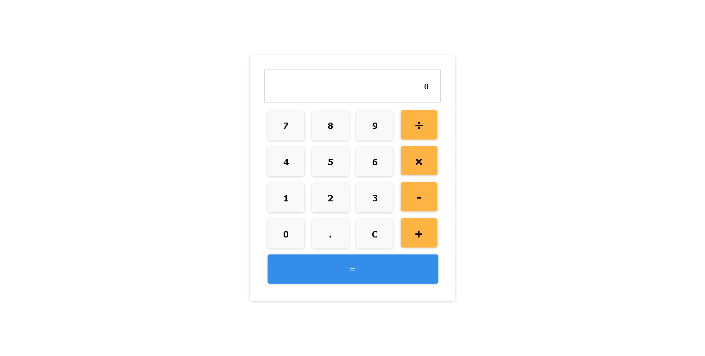

# Calculadora

## Conteúdo

- [Overview](#overview)
  - [Desafio](#desafio)
  - [Screenshot](#screenshot)
  - [Links](#links)
- [Processo](#processo)
  - [Feito utilizando](#feito-utilizando)
- [Autor](#autor)

## Overview

Calculadora contendo as 4 operações matemáticas básicas (adição, subtração, multiplicação e divisão), criada com foco em javascript puro.

### Desafio

Os usuários devem:

- Aplicar as quadro equações matemáticas básicas;
- Apagar as informações dispostas na tela;
- Ter acesso ao resultado da equação;
- Realizar quantas contas desejar;

### Screenshot

### Links

- Solução: [GitHub Repo](https://github.com/lucasfs022/Number-Guesser)
- Live Site URL: [GitHub live site](https://lucasfs022.github.io/Number-Guesser/)

## Processo

### Feito utilizando

- HTML5; 
- CSS3;
- Javascript.

## Autor

- Website - [Lucas Silva](https://www.lfsdev.com.br)
- Linkedin - [Lucas Silva](https://www.linkedin.com/in/lucas-silva-658980161)